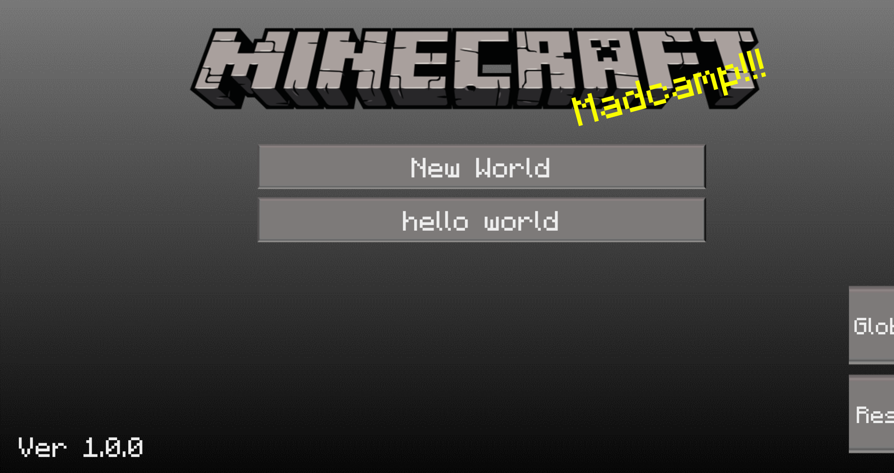
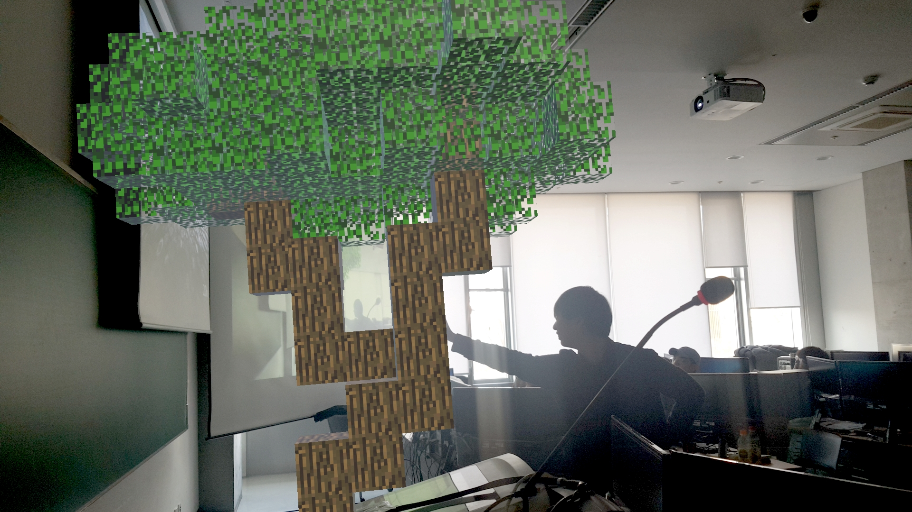

# Minecraft AR

KAIST 2019 Madcamp winter

Cho Jaemin
Song woomin

## About

2019 겨울 몰입캠프 3주차에 만든 AR 마인크래프트 게임입니다.

## Used
* Unity
* Google ARCore
* Nodejs server with Socket.io

## Features
### Home Screen

게임 시작 화면입니다.
* New World: 새로운 맵을 생성합니다.
* Load world (ex> Hello World): 기존에 저장된 맵을 불러옵니다.
* Global: 제작한 맵을 공유할 수 있는 서버에 접속합니다.
* Reset: 저장된 맵을 모두 삭제합니다.

### Game Screen

ARCore가 평면을 인식한 후, 화면을 터치하면 블럭 선택 창이 생기게 됨니다.

* 블럭 선택 창에서 원하는 블럭을 선택해 쌓을 수 있습니다. TNT 블럭을 쌓은 후 터뜨릴 수도 있습니다.
* 화면 상단의 네모 버튼을 누르면 버튼이 모두 사라집니다.
* 화면 상단의 5x 버튼을 누르면 Landmark mode로 진입합니다.
* 저장 버튼을 누르면 맵이 저장됩니다.

### Landmark Mode

Landmark mode에서는 플레이어가 자신이 만든 블럭을 5배 큰 사이즈로 만나볼 수 있습니다. 위의 사진은 블럭을 쌓아 만든 나무를 Lankmark mode에서 본 사진입니다.

